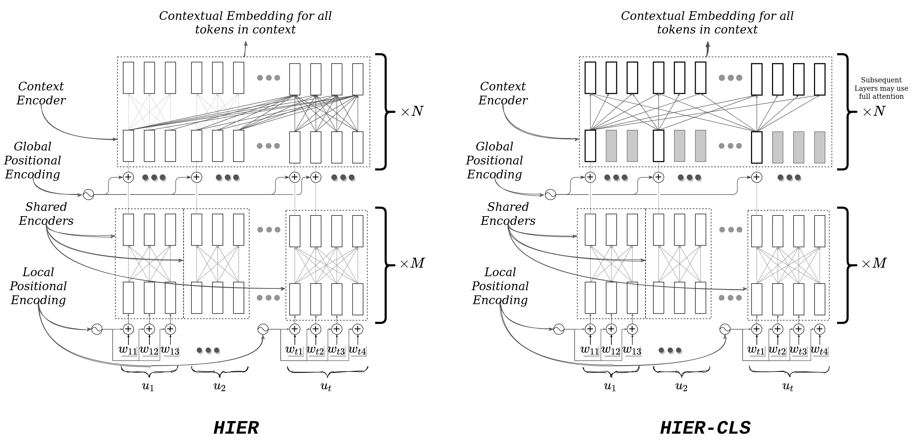
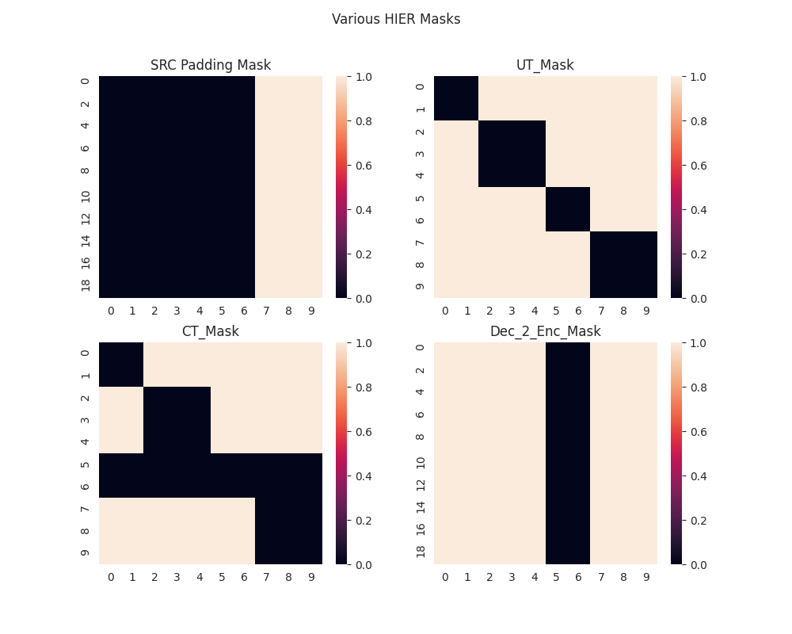
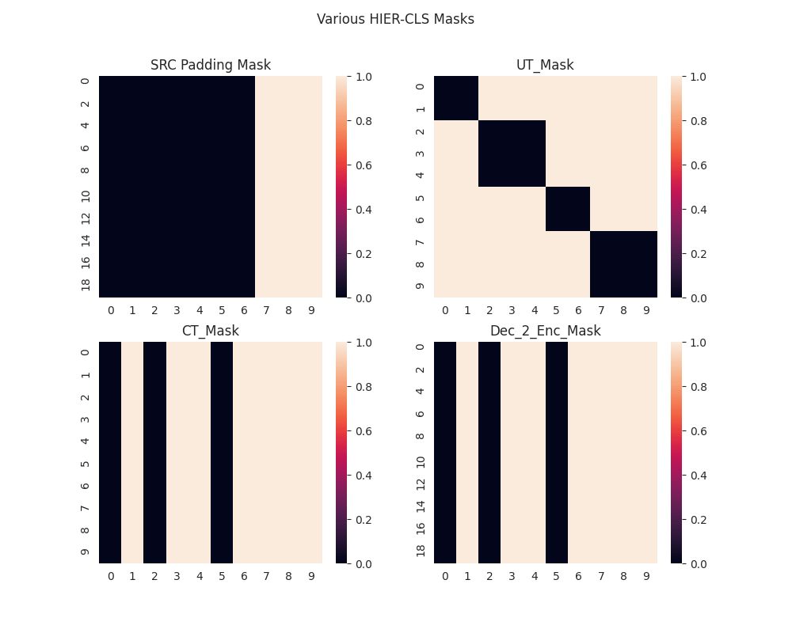

**Figure 1:** Detailed Architecture for a **Hierarchical Transformer Encoder** or **HT-Encoder**: The main inductive bias incorporated in this model is to encode the full dialog context hierarchically in two stages. This is done by the two encoders, 1) Shared Utterance Encoder (M layers) and 2) Context Encoder (N layers), as shown in the figure. Shared encoder first encodes each utterance () individually to extract the utterance level features. The same parameterized Shared Encoder is used for encoding all utterances in the context. In the second Context Encoder the full context is encoded using a single transformer encoder for extracting dialog level features. The attention mask in context encoder decides how the context encoding is done and is a choice of the user. This one depicted in the figure is for the HIER model described in Section 2.3 of paper. Only the final utterance in the Context Encoder gets to attend over all the previous utterances as shown. This allows the model to have access to both utterance level features and dialog level features till the last layer of the encoding process. Notation: Utterance , ,  is the word embedding for  word in  utterance.

# HIER - Pytorch

Implementation of <a href="https://arxiv.org/abs/2011.08067">HIER</a>, in Pytorch

> **Title**: Hierarchical Transformer for Task Oriented Dialog Systems.
> *Bishal Santra, Potnuru Anusha and Pawan Goyal* (NAACL 2021, Long Paper)


## Install

```bash
Coming soon...
```

## Usage

```python
import torch
from hier_transformer_pytorch import HIERTransformer, get_hier_encoder_mask

# Model
hier_transformer = HIERTransformer(nhead=16, num_encoder_layers=12, vocab_size=1000)

# Random input
src = torch.randint(0, 1000, (10, 32)).long() # S x N
tgt = torch.randint(0, 1000, (20, 32)).long() # T x N
src_padding_mask = torch.tensor([0, 0, 0, 0, 0, 0, 0, 1, 1, 1]).unsqueeze(0).expand(32, -1)
utt_indices = torch.tensor([0, 0, 1, 1, 1, 2, 2, 3, 3, 3]).unsqueeze(0).expand(32, -1)

# forward
out = hier_transformer.forward(src, tgt, utt_indices=utt_indices, src_key_padding_mask=src_padding_mask)

print(f"src: {src.shape}, tgt: {tgt.shape} -> out: {out.shape}")
# Output: src: torch.Size([10, 32]), tgt: torch.Size([20, 32]) -> out: torch.Size([20, 32, 512])
```

### Or run `python tests.py`

> Padding is attended by padding to prevent `inf` output from softmax 
> function in attention. Otherwise we will have a situation like 
> `softmax([-inf, -inf, ..., -inf])`. CT-Mask should be designed in a way to make 
> sure that we don't attend to padding indices.




## Running the Experiments

```bash
Coming soon...
```

## Citations

```bibtex
@misc{santra2021hierarchical,
      title={Hierarchical Transformer for Task Oriented Dialog Systems}, 
      author={Bishal Santra and Potnuru Anusha and Pawan Goyal},
      year={2021},
      eprint={2011.08067},
      archivePrefix={arXiv},
      primaryClass={cs.CL}
}
```

## Acknowledgements

We thank the authors and developers 
